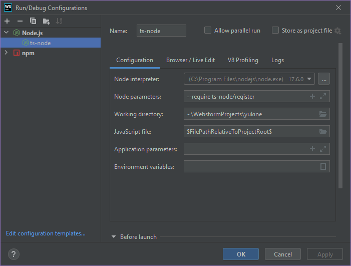

  

## Run > Edit Configurations...

- ### Add new configuration _clicking_ by **+** icon.
- ### Select Node.js and set `Node parameters` to

```console
--require ts-node/register
```

- ### Into `JavaScript File` section put this macro

```console
$FilePathRelativeToProjectRoot$
``` 

- ### Make sure `ts-node` added to devDependencies.

```console
npm i -D ts-node
```
---

